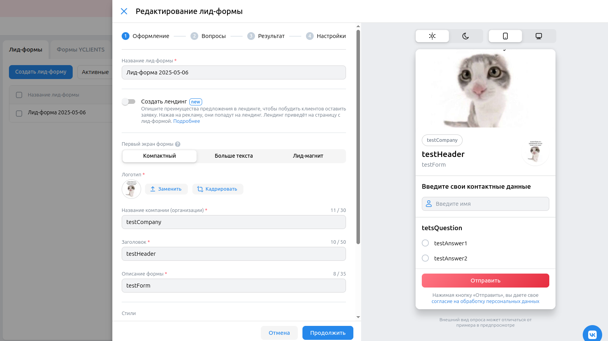

# Лид-формы и опросы
Ссылка на раздел: https://ads.vk.com/hq/leadads/leadforms

- если у пользователя есть активные лид-формы, то при переходе в раздел меню "Лид-формы и опросы" в личном кабинете эти лид-формы показываются

- если у пользователя нет активных лид-форм, то при переходе в раздел меню "Лид-формы и опросы" в личном кабинете появляется кнопка "Создать лид-форму"

## Создание лид-формы
- при нажатии кнопки "Создать лид-форму" появляется модальное окно "Новая лид-форма"

- первым блоком модального окна "Новая лид-форма" расположены 4 этапа "Оформление", "Вопросы", "Результат", "Настройки"
- модальное окно "Новая лид-форма" состоит из 2х частей: раздела для заполнения лид-формы и раздела предпросмотра создаваемой лид-формы

### Этап "Оформление"
- в модальном окне "Новая лид-форма" есть обязательные поля "Название лид-формы", "Логотип", "Название компании", "Заголовок", "Описание формы"
- при вводе названия компании длиннее 30 символов и нажатии кнопки "Продолжить" под этим полем появляется ошибка "Сократите текст"
- при вводе заголовка длиннее 50 символов и нажатии кнопки "Продолжить" под этим полем появляется ошибка "Сократите текст"

- при вводе описания длиннее 35 символов и нажатии кнопки "Продолжить" под этим полем появляется ошибка "Сократите текст"
- при нажатии кнопки "Продолжить" с незаполненным обязательным полем под этим полем появляется ошибка "Нужно заполнить"
- при нажатии кнопки "Продолжить" с незаполненным обязательным полем не отображается форма следующего этапа
- при нажатии кнопки "Продолжить" с заполненными обязательными полями отображается форма следующего этапа
- тектс, введенный в поле "Название компании", появляется в разделе предпросмотра

- текст, введенный в поле "Заголовок", появляется в разделе предпросмотра
- текст, введенный в поле "Описание формы", появляется в разделе предпросмотра
- загруженное изображение в поле "Логотип" появляется в разделе предпросмотра
- при выборе цвета в разделе "Стили" тот же цвет применяется для в разделе предпросмотра
- загруженное изображение в поле "Обложка" появляется в разделе предпросмотра

### Этап "Вопросы"

- при переходе на этап "Вопросы" появляются 2 раздела "Вопросы" и "Контактная информация"
- в разделе "Контактная информация" по умолчанию находятся drag-and-drop элементы "Имя" и "Номер телефона"
- при удалении всех полей для заполнения контактных данных в разделе "Контактная информация" возникает ошибка "Минимальное количество полей: 1" 

- при удалении всех полей для заполнения контактных данных и нажатии кнопки "Продолжить" переход на следующий этап не происходит
- форма, добавленная в разделе "Контактные данные", появляется в разделе предпросмотра
- при нажатии кнопки "Продолжить" без добавленных вопросов происходит переход на следующий этап
- при добавлении вопроса появляется форма для заполнения текста вопроса и вариантов ответа
- если вопрос имеет пустое описание или менее 2х вариантов ответа, при нажатии на кнопку "Продолжить" форма подсвечивается красным

- при нажатии кнопки "Продолжить" с незаполненным описанием вопроса или менее, чем с 2мя вариантами ответа, переход на следующий этап не происходит
- при добавлении вопроса он появляется в разделе предпросмотра

- при добавлении варианта ответа он появляется в разделе предпросмотра

### Этап "Результат"

- при нажатии кнопки "Продолжить" с пустым обязательным полем "Заголовок" переход на следующий этап не происходит
- текст, введенный в поле "Заголовок", так же появляется в разделе предпросмотра
- при вводе заголовка длиннее 25 символов появляется ошибка "Сократите текст"
- текст, введенный в поле "Описание", так же появляется в разделе предпросмотра
- при вводе описания длиннее 160 символов появляется ошибка "Сократите текст" 
- при вводе текста в поле "Ссылка на сайт" в разделе предпросмотра появляется кнопка "Перейти на сайт"

- телефон, введенный в поле "Телефон для заказа", так же появляется в разделе предпросмотра
- текст, введенный в поле "Промокод", так же появляется в разделе предпросмотра

### Этап "Настройки"

- при проставлении чекбокса "Уведомлять о новых заявках по email" появляется форма для ввода email

- при проставлении чекбокса "Обязательные вопросы" появляется модальное окно с названием "Сделать все вопросы обязательными?"

- при нажатии кнопки "Сохранить" без заполненных обязательных форм "Фамилия, имя, отчество" и "Адрес регистрации по месту жительства" сохранение формы не происходит, под формами появляется ошибка "Нужно заполнить"
- при нажатии кнопки "Сохранить" с заполненными обязательными полями модальное окно "Новая лид-форма" закрывается

### После создания лид-формы

- после сохранения лид-форма она появляется в списке лид-форм с введенным при создании названием
- после сохранения лид-форма имеет статус "Активна"
- после сохранения лид-форма имеет сегодняшнюю дату создания

## Действия с лид-формами
- при наведении на активную лид-форму под ее названием появляются кнопки "Редактировать" и "Архивировать"

- при нажатии на кнопку "Редактировать" появляется модальное окно "Редактирование лид-формы"

- при нажатии кнопки "Архивировать" появляется модальное окно подтверждения с вопросом "Архивировать лид-форму?"
- при нажатии кнопки "Архивировать" в модальном окне подтверждения лид-форма пропадает из списка активных лид-форм
- при выборе в выпадающем меню варианта "В архиве" показываются заархивированные лид-формы
- при наведении на заархивированную лид-форму появляется кнопка "Восстановить"

- при нажатии кнопки "Восстановить" появляется модальное окно подтверждения
- при нажатии кнопки "Восстановить" в модальном окне подтверждения выбранная лид-форма появляется в списке активных лид-форм

## Обучение

- если отсутствуют активные лид-формы, показывается кнопка "Пройти обучение"
- при нажатии на кнопку пройти обучение повляется модальное окно с вариантами обучения

